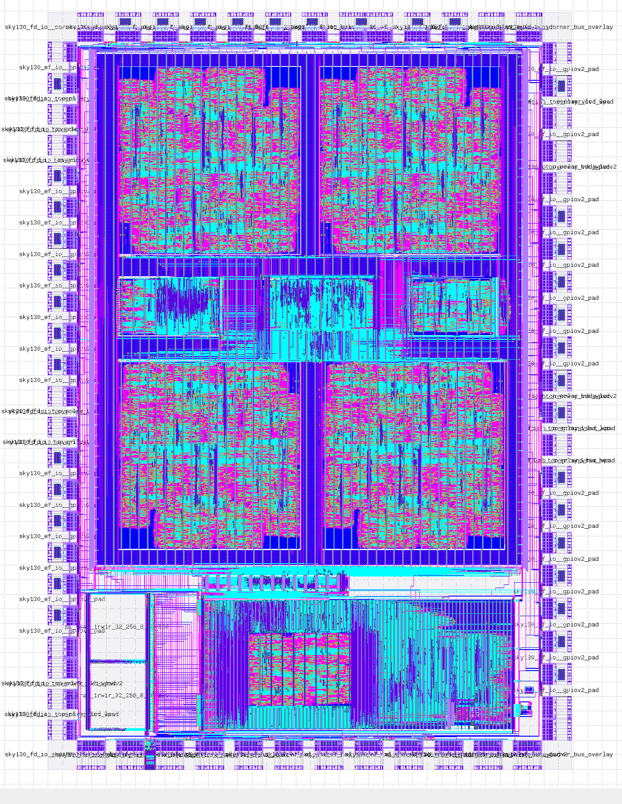

# Caravel_N5_SoC

The repo contains the N5 SoC integratin with the [Caravel](https://github.com/efabless/caravel/tree/master) chip. For the SoC related development, refer to [N5 SoC](https://github.com/shalan/N5_SoC)

# Caravel Integration 

### Verilog View

The SoC utilizes the caravel IO ports and logic analyzer probes. Refer to [user_project_wrapper.v](verilog/rtl/user_project_wrapper.v)

| Caravel-IO    | Chameloen SoC |  Mode
| ------------- | ------------- | -------------
|  io[13:0]     | GPIO          | Bi-directional
|  io[17:14]    | flash         | Bi-directional
|  io[18]       | flash clk     | Output
|  io[19]       | flash enable  | Output
|  io[20]       | UART0 RX      | Input
|  io[21]       | UART0 TX      | Output
|  io[22]       | UART1 RX      | Input
|  io[23]       | UART1 TX      | Output
|  io[24]       | SPI0 I        | Input
|  io[25]       | SPI0 O        | Output
|  io[26]       | SPI0 SSn      | Output
|  io[27]       | SPI0 CLK      | Output
|  io[28]       | SPI1 I        | Input
|  io[29]       | SPI1 O        | Output
|  io[30]       | SPI1 SSn      | Output
|  io[31]       | SPI1 CLK      | Output
|  io[32]       | I2C0 IO       | Bi-directional
|  io[33]       | I2C0 IO       | Bi-directional
|  io[34]       | I2C1 IO       | Bi-directional
|  io[35]       | I2C1 IO       | Bi-directional
|  io[36]       |  pwm0         | Output
|  io[37]       |  pwm1         | Output

### GDS View

